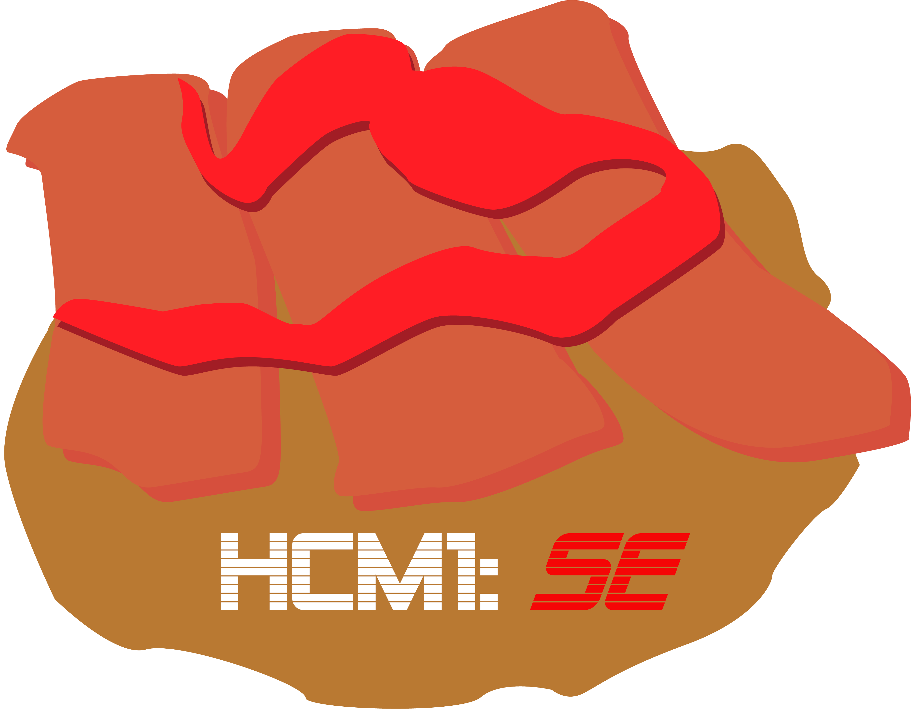

<!--
*** Thanks for checking out the Best-README-Template. If you have a suggestion
*** that would make this better, please fork the repo and create a pull request
*** or simply open an issue with the tag "enhancement".
*** Don't forget to give the project a star!
*** Thanks again! Now go create something AMAZING! :D
-->

<!-- PROJECT SHIELDS -->
<!--
*** I'm using markdown "reference style" links for readability.
*** Reference links are enclosed in brackets [ ] instead of parentheses ( ).
*** See the bottom of this document for the declaration of the reference variables
*** for contributors-url, forks-url, etc. This is an optional, concise syntax you may use.
*** https://www.markdownguide.org/basic-syntax/#reference-style-links
-->

<!-- PROJECT LOGO -->
 

  

<h3 align="center">Hiper Calculadora Mark II:
Sopaipleto Edition</h3>

  

    Repositorio del proyecto del graficador interactivo del grupo "Los Sopaipletos".
     
     
    
  

<!-- TABLE OF CONTENTS -->

  
Tabla de contenidos

  <ol>
    <li>
      <a href="#about-the-project">Sobre el proyecto</a>
      <ul>
        <li><a href="#built-with">Tecnologias utilizadas</a></li>
        <li><a href="#participants">Integrantes</a></li>
      </ul>
    </li>
    <li><a href="#usage">Uso</a></li>
  </ol>

<!-- ABOUT THE PROJECT -->
## Sobre el proyecto

[![Product Name Screen Shot][product-screenshot]](https://example.com)

El objetivo del proyecto es Diseñar e implementar una aplicación que permita “dibujar” de manera interactiva una expresión matemática con operaciones básicas, de tal manera que se muestre gráficamente en un panel.

La contrucción de la aplicación se encrementará a medida que las unidades del Modulo de Proyecto de Programación avance según lo planificado por el Docente.

Para la Unidad 1, se debe:
- [x] Crear Repositorio Github, con al menos un branch por cada integrante del grupo
- [x] Crear y mantener un Tablero Kanban
- [x] Definir un diseño que guie el desarrollo del proyecto
- [x] La aplicacion debe permitir ingresar interactivamente una expresion matematica
- [x] La aplicación debe permitir dibujar los números del 0 al 9.
- [x] La aplicación de debe permitir dibujar los operadores de suma (+), resta(-), multiplicación(*) y división(/). 

Para la Unidad 2, se debe:

- [x] La aplicación debe cumplir con los requisitos indispensables y deseables de las unidades anteriores.
- [x] Implementar el botón “limpiar” (CE), que regresa el programa a su estado inicial (borra el contenido del control de visualización).

- [x] Agregar operadores de potencia, factorial, seno, coseno, y tangente, mostrando su equivalente dibujado dentro de la fórmula. Distinga números de grados.
- [x] Mostrar en un panel independiente y visible (ej., un TextBox) la secuencia de números y operadores ingresados, respetando la precedencia de los operadores.

- [x] Agregar los símbolos y lógica de los paréntesis. Cuando se usen en divisiones, los paréntesis deben “crecer” para cubrir la división y los otros números de la expresión.

(<a href="#top">back to top</a>)

### Tecnologias utilizadas

- JDK 8u111 (Herramienta de desarrollo)
- NetBeans 8.2 (IDE)
- SceneBuilder (Interfaz)
- JavaFx (Interfaz)

(<a href="#top">back to top</a>)

### Integrantes

- Guillermo Bustamante
- Robinson Galvez
- Juan Machuca

<!-- GETTING STARTED -->

(<a href="#top">back to top</a>)

<!-- USAGE EXAMPLES -->
## Uso

_En construcción_

(<a href="#top">back to top</a>)

<!-- CONTACT -->
## Contacto

- Guillermo Bustamante - [Gbustarr](https://github.com/Gbustarr)
- Robinson Galvez - [Neuromender](https://github.com/Neuromender)
- Juan Machuca - [Juan Machuca](https://github.com/JCCH1)

Enlace del Proyecto: [Enlace](https://github.com/Gbustarr/ProyectoProgramacion2022)

(<a href="#top">back to top</a>)

(<a href="#top">back to top</a>)

<!-- MARKDOWN LINKS & IMAGES -->
<!-- https://www.markdownguide.org/basic-syntax/#reference-style-links -->
[contributors-shield]: https://img.shields.io/github/contributors/github_username/repo_name.svg?style=for-the-badge
[contributors-url]: https://github.com/github_username/repo_name/graphs/contributors
[forks-shield]: https://img.shields.io/github/forks/github_username/repo_name.svg?style=for-the-badge
[forks-url]: https://github.com/github_username/repo_name/network/members
[stars-shield]: https://img.shields.io/github/stars/github_username/repo_name.svg?style=for-the-badge
[stars-url]: https://github.com/github_username/repo_name/stargazers
[issues-shield]: https://img.shields.io/github/issues/github_username/repo_name.svg?style=for-the-badge
[issues-url]: https://github.com/github_username/repo_name/issues
[license-shield]: https://img.shields.io/github/license/github_username/repo_name.svg?style=for-the-badge
[license-url]: https://github.com/github_username/repo_name/blob/master/LICENSE.txt
[linkedin-shield]: https://img.shields.io/badge/-LinkedIn-black.svg?style=for-the-badge&logo=linkedin&colorB=555
[linkedin-url]: https://linkedin.com/in/linkedin_username
[product-screenshot]: img/Banner.png
